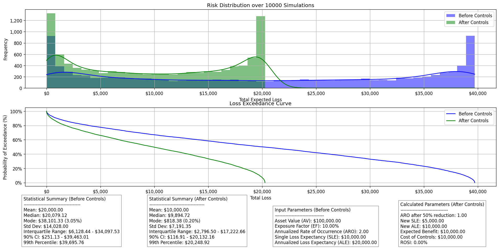

# Risk Quant Calculator

A risk calculation tool for approaching cybersecurity risk using statistical methods.

## Overview

This tool is designed for performing quantitative risk assessments and analyzing the monetary impact of cybersecurity risks, optionally incorporating the effectiveness of risk controls. This tool is designed to be used on the command line but its output can be easily integrated into other applications through the use of JSON.

`risk_simulator.py` - Uses Monte Carlo or Markov Chain Monte Carlo simulation to:
- Model potential losses based on asset value, exposure factor, and rate of occurrence
- Analyze effectiveness of risk controls through before/after comparisons
- Generate risk distributions and loss exceedance curves
- Calculate key risk statistics and percentiles

## Installation

Requirements:
```bash
pip install -r requirements.txt
```

## Structure

```plaintext
.
├── .venv
├── .gitignore
├── LICENSE
├── README.md
├── readme_media
│   └── output_example_mc.png
├── requirements.txt
├── risk_simulator.py
├── mcmc_verification.py
├── input_example.csv
├── input_example.json
├── output_x.json (Generated by risk_simulator.py)
└── output_x.png (Generated by risk_simulator.py)
```

## Usage

1. Open `input_example.csv` and input your data. Alternatively, you can use the `input_example.json` file to input your data. The input file should have the following columns or keys:
   - `id`: A number identifying the combination of the risk and control used to treat it
   - `asset_value`: The value of the asset at risk
   - `exposure_factor`: The percentage of the asset that would be lost in the event of a breach
   - `annual_rate_of_occurrence`: The frequency at which the event occurs
   - `percentage_reduction`: The percentage reduction in risk due to the control
   - `cost_of_control`: The cost of the control (assumed to be the total cost of the control)

2. In `risk_simulator.py` ensure that the `main` function is called with the correct input file name. The default is `input_example.csv`.

3. Change the desired output file name in the `main` function. The default is a .png file corresponding to each row's id in the input file.

4. Run the script using the following command:

```bash
python risk_simulator.py
```

5. The script will output a series of graphs and statistics for each row in the input file. The output will be saved in the root directory.

## Examples

In the following example, we will use the input file `input_example.csv` to run a Monte Carlo simulation and generate a series of statistics and graphs for the given risk scenario.

#### Input File

```csv
id,asset_value,exposure_factor,annual_rate_of_occurrence,percentage_reduction,cost_of_control
1,100000,0.1,2,50,10000
```

#### Output File

```json
{
    "before_controls_stats": {
        "mean": 20000.000000000007,
        "median": 20079.12232037718,
        "mode": 39507.07280381663,
        "mode_percentage": 6.47,
        "std_dev": 14027.995618794579,
        "percentile_1": 13.246744963835809,
        "percentile_2.5": 70.30950847885563,
        "percentile_5": 251.12814073661758,
        "percentile_10": 979.6592556962727,
        "percentile_25": 6128.444225401311,
        "percentile_75": 34097.53285472107,
        "percentile_90": 38778.53017793577,
        "percentile_97.5": 39643.60209467536,
        "percentile_99": 39695.760656933606
    },
    "after_controls_stats": {
        "mean": 10000.0,
        "median": 9894.721290768928,
        "mode": 101.27477803994391,
        "mode_percentage": 6.660000000000001,
        "std_dev": 7191.345130254547,
        "percentile_1": 3.861893212737458,
        "percentile_2.5": 24.04980746080127,
        "percentile_5": 116.90860274253455,
        "percentile_10": 453.19393785212566,
        "percentile_25": 2796.4990299430856,
        "percentile_75": 17222.65943226759,
        "percentile_90": 19754.30208951885,
        "percentile_97.5": 20221.86425518434,
        "percentile_99": 20248.917917030638,
        "first_nonzero_percentile": 0.04,
        "first_nonzero_value": 0.005406473529262564
    },
    "input_parameters": {
        "asset_value": 100000.0,
        "exposure_factor": 0.1,
        "annual_rate_of_occurrence": 2.0,
        "single_loss_expectancy": 10000.0,
        "annualized_loss_expectancy": 20000.0
    },
    "calculated_parameters": {
        "adjusted_aro": 1.0,
        "adjusted_ale": 10000.0,
        "reduction_percentage": 50.0,
        "expected_benefit": 10000.0,
        "cost_of_controls": 10000.0,
        "rosi_percentage": 0.0
    },
    "simulation_results": {
        "losses": [ ... ],
        "adjusted_losses": [ ... ],
        "exceedance_probabilities": [ ... ],
        "adjusted_exceedance_probabilities": [ ... ]
    }
}
```

#### Output Graph



## To Do

- [X] Add Monte Carlo simulation
- [X] Add mean, median, mode, standard deviation, and percentiles
- [X] Add loss exceedance curve
- [X] Add before/after risk control analysis
- [x] Better way to input data
- [x] Add Markov Chain Monte Carlo to before/after risk control analysis
- [ ] Argparser input for risk_simulator.py
- [ ] Add more risk analysis scenarios (e.g. multiple controls)
- [ ] Add more risk control analysis options (e.g. bayesian analysis)
