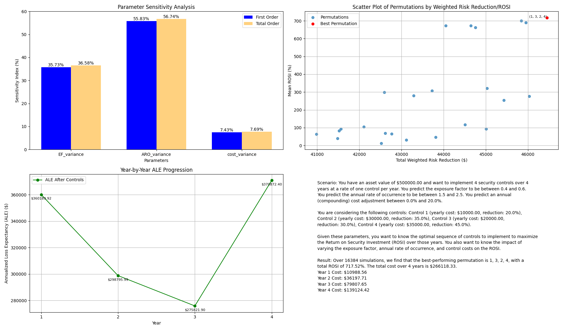

# Risk Quant Calculator

A risk calculation tool for approaching cybersecurity risk using statistical methods.

## Overview

This tool is designed for performing quantitative risk assessments and analyzing the monetary impact of cybersecurity risks, optionally incorporating the effectiveness of risk controls. This tool is designed to be used on the command line but its output can be easily integrated into other applications through the use of JSON.

Note that in all cases, the tool applies a random seed value of 42 (through a constant) to ensure reproducibility of results. Therefore, the **same results are output** given the **same input data**. This can be beneficial for verification and validation purposes.

`risk_simulator.py` - Uses Monte Carlo or Markov Chain Monte Carlo simulation to:
- Model potential losses based on asset value, exposure factor, and rate of occurrence
- Analyze effectiveness of risk controls through before/after comparisons
- Generate risk distributions and loss exceedance curves
- Calculate key risk statistics and percentiles

`rqmc_sobol_sensitivity_analysis.py` - Uses Sobol sensitivity analysis with randomized quasi-Monte Carlo (RQMC) to:
- Analyze the sensitivity of return on security investment (ROSI) to changes in input parameters
- Optimize the permutation of implementation of risk controls given uncertainty in exposure factors, rates of occurrence, and control costs
- Generate sensitivity indices for each input parameter
- Rank the effectiveness of different control permutations based on ROSI
- Calculate the cost of each control over time given a randomized range of cost adjustments

## Installation

Requirements:
```bash
pip install -r requirements.txt
```

## Structure

```plaintext
.
├── .venv
├── .gitignore
├── LICENSE
├── README.md
├── readme_media
│   ├── output_example_mc.png
│   └── output_example_rqmc.png
├── requirements.txt
├── risk_simulator.py
├── mcmc_verification.py
├── input_example.csv
├── input_example.json
├── output_x.json (Generated by risk_simulator.py)
├── output_x.png (Generated by risk_simulator.py)
├── rqmc_sobol_sensitivity_analysis.py
├── rqmc_sobol_example.csv
├── rqmc_sobol_x.json (Generated by rqmc_sobol_sensitivity_analysis.py)
└── rqmc_sobol_x.png (Generated by rqmc_sobol_sensitivity_analysis.py)
```

## Usage

### Monte Carlo Simulation

1. Open `input_example.csv` and input your data. Alternatively, you can use the `input_example.json` file to input your data. The input file should have the following columns or keys:
   - `id`: A number identifying the combination of the risk and control used to treat it
   - `asset_value`: The value of the asset at risk
   - `exposure_factor`: The percentage of the asset that would be lost in the event of a breach
   - `annual_rate_of_occurrence`: The frequency at which the event occurs
   - `percentage_reduction`: The percentage reduction in risk due to the control
   - `cost_of_control`: The cost of the control (assumed to be the total cost of the control)

2. In `risk_simulator.py` ensure that the `main` function is called with the correct input file name. The default is `input_example.csv`.

3. Change the desired output file name in the `main` function. The default is a .png file corresponding to each row's id in the input file.

4. Run the script using the following command:

```bash
python risk_simulator.py
```

5. The script will output a series of graphs and statistics for each row in the input file. The output will be saved in the root directory.

### Markov Chain Monte Carlo Simulation

Same as Monte Carlo Simulation, but manually modify the `main` function in `risk_simulator.py` to use `simulation_method=1` to use Markov Chain Monte Carlo simulation.

### RQMC Sobol Sensitivity Analysis

1. Open `rqmc_sobol_example.csv` and input your data. The input file should have the following columns:
   - `id`: A number identifying the combination of the risk and control used to treat it
   - `asset_value`: The value of the asset at risk
   - `exposure_factor_min`: The minimum percentage of the asset that would be lost in the event of a breach
   - `exposure_factor_max`: The maximum percentage of the asset that would be lost in the event of a breach
   - `annual_rate_of_occurrence_min`: The minimum frequency at which the event occurs
   - `annual_rate_of_occurrence_max`: The maximum frequency at which the event occurs
   - `cost_adjustment_min`: The minimum cost adjustment for the control
   - `cost_adjustment_max`: The maximum cost adjustment for the control

2. In the same file, add one set of `control_reduction` and `control_cost` columns for each control you want to analyze. The columns should be named as follows:
   - `control_reduction_1`: The percentage reduction in risk due to the first control
   - `control_cost_1`: The cost of the first control
   - `control_reduction_2`: The percentage reduction in risk due to the second control
   - `control_cost_2`: The cost of the second control
   - etc.

3. In `rqmc_sobol_sensitivity_analysis.py` ensure that the `main` function is called with the correct input file name. The default is `rqmc_sobol_example.csv`.

4. Change the desired output file name in the `main` function. The default are .png and .json files corresponding to each row's id in the input file.

5. Run the script using the following command:

```bash
python rqmc_sobol_sensitivity_analysis.py
```

6. The script will output a series of graphs and statistics for each row in the input file. The output will be saved in the root directory.

## Examples

### Monte Carlo Simulation

In the following example, we will use the input file `input_example.csv` to run a Monte Carlo simulation and generate a series of statistics and graphs for the given risk scenario.

#### Input File

```csv
id,asset_value,exposure_factor,annual_rate_of_occurrence,percentage_reduction,cost_of_control
1,100000,0.1,2,50,10000
```

#### Output File

```json
{
    "before_controls_stats": {
        "mean": 20000.000000000007,
        "median": 20079.12232037718,
        "mode": 39507.07280381663,
        "mode_percentage": 6.47,
        "std_dev": 14027.995618794579,
        "percentile_1": 13.246744963835809,
        "percentile_2.5": 70.30950847885563,
        "percentile_5": 251.12814073661758,
        "percentile_10": 979.6592556962727,
        "percentile_25": 6128.444225401311,
        "percentile_75": 34097.53285472107,
        "percentile_90": 38778.53017793577,
        "percentile_97.5": 39643.60209467536,
        "percentile_99": 39695.760656933606
    },
    "after_controls_stats": {
        "mean": 10000.0,
        "median": 9894.721290768928,
        "mode": 101.27477803994391,
        "mode_percentage": 6.660000000000001,
        "std_dev": 7191.345130254547,
        "percentile_1": 3.861893212737458,
        "percentile_2.5": 24.04980746080127,
        "percentile_5": 116.90860274253455,
        "percentile_10": 453.19393785212566,
        "percentile_25": 2796.4990299430856,
        "percentile_75": 17222.65943226759,
        "percentile_90": 19754.30208951885,
        "percentile_97.5": 20221.86425518434,
        "percentile_99": 20248.917917030638,
        "first_nonzero_percentile": 0.04,
        "first_nonzero_value": 0.005406473529262564
    },
    "input_parameters": {
        "asset_value": 100000.0,
        "exposure_factor": 0.1,
        "annual_rate_of_occurrence": 2.0,
        "single_loss_expectancy": 10000.0,
        "annualized_loss_expectancy": 20000.0
    },
    "calculated_parameters": {
        "adjusted_aro": 1.0,
        "adjusted_ale": 10000.0,
        "reduction_percentage": 50.0,
        "expected_benefit": 10000.0,
        "cost_of_controls": 10000.0,
        "rosi_percentage": 0.0
    },
    "simulation_results": {
        "losses": [ ... ],
        "adjusted_losses": [ ... ],
        "exceedance_probabilities": [ ... ],
        "adjusted_exceedance_probabilities": [ ... ]
    }
}
```

#### Output Graph


### RQMC Sobol Sensitivity Analysis

In the following example, we will use the input file `rqmc_sobol_example.csv` to run an RQMC Sobol Sensitivity Analysis and generate a series of statistics and graphs for the given risk scenario.

#### Input File

```csv
id,asset_value,exposure_factor_min,exposure_factor_max,annual_rate_of_occurrence_min,annual_rate_of_occurrence_max,cost_adjustment_min,cost_adjustment_max,control_reduction_1,control_cost_1,control_reduction_2,control_cost_2,control_reduction_3,control_cost_3,control_reduction_4,control_cost_4
1,500000,0.4,0.6,1.5,2.5,0,0.2,0.2,10000,0.35,30000,0.3,20000,0.45,35000
```

#### Output File

```json
{
    "simulation_parameters": {
        "asset_value": 500000.0,
        "ef_range": [
            0.4,
            0.6
        ],
        "aro_range": [
            1.5,
            2.5
        ],
        "control_reductions": [
            0.2,
            0.35,
            0.3,
            0.45
        ],
        "control_costs": [
            10000.0,
            30000.0,
            20000.0,
            35000.0
        ],
        "cost_adjustment_range": [
            0.0,
            0.2
        ],
        "num_samples": 16384,
        "num_years": 4,
        "kurtosis": 1.7
    },
    "results": {
        "best_permutation": [
            1,
            3,
            2,
            4
        ],
        "best_rosi": 717.5249857838003,
        "control_cost_values": {
            "year_0": {
                "control_1": {
                    "cost": 10000.0,
                    "adjustment": 0.0
                },
                "control_2": {
                    "cost": 30000.0,
                    "adjustment": 0.0
                },
                "control_3": {
                    "cost": 20000.0,
                    "adjustment": 0.0
                },
                "control_4": {
                    "cost": 35000.0,
                    "adjustment": 0.0
                }
            },
            "year_1": {
                "control_1": {
                    "cost": 10988.562225974487,
                    "adjustment": 0.09885622259744861
                },
                "control_2": {
                    "cost": 33049.97576349127,
                    "adjustment": 0.1016658587830423
                },
                "control_3": {
                    "cost": 21972.924726080673,
                    "adjustment": 0.09864623630403373
                },
                "control_4": {
                    "cost": 38545.22556409097,
                    "adjustment": 0.1012921589740278
                }
            },
            "year_2": {
                "control_1": {
                    "cost": 12095.900302809629,
                    "adjustment": 0.10077188025724096
                },
                "control_2": {
                    "cost": 36373.98990935902,
                    "adjustment": 0.10057538830450935
                },
                "control_3": {
                    "cost": 24101.80951964268,
                    "adjustment": 0.0968867285580393
                },
                "control_4": {
                    "cost": 42431.02142382501,
                    "adjustment": 0.10081134051928023
                }
            },
            "year_3": {
                [ ... ]
            },
            "year_4": {
                [ ... ]
            }
        }
    },
    "ranked_permutations": [
        {
            "permutation": [
                1,
                3,
                2,
                4
            ],
            "total_rosi": 717.5249857838003,
            "year_1": {
                "ale_before": 450237.3955980828,
                "ale_after": 360189.91647846624,
                "control_cost": 10988.562225974487,
                "total_cost": 10988.562225974487,
                "rosi": 719.4655248596999
            },
            "year_2": {
                [ ... ]
            },
            "year_3": {
                [ ... ]
            },
            "year_4": {
                [ ... ]
            }
        },
        [ ... ]
    ],
    "sensitivity_results": {
        "S1": [
            0.3573421722476149,
            0.5583346608921688,
            0.07431662153058312
        ],
        "S1_conf": [
            0.010901317622304516,
            0.01452524609955382,
            0.0057309539478987885
        ],
        "ST": [
            0.3657925056862101,
            0.5673534864586351,
            0.07687384917168154
        ],
        "ST_conf": [
            0.007715407852329051,
            0.01161656347325818,
            0.0016888009659389485
        ]
    }
}
```

#### Output Graph



## To Do

- [X] Add Monte Carlo simulation
- [X] Add mean, median, mode, standard deviation, and percentiles
- [X] Add loss exceedance curve
- [X] Add before/after risk control analysis
- [x] Better way to input data
- [x] Add Markov Chain Monte Carlo to before/after risk control analysis
- [x] Add Sobol sequence generation method
- [x] Add RQMC method to risk analysis
- [x] Modify Sobol sequence generation to work with RQMC
- [x] Display natural language in RQMC rather than list of inputs
- [x] Add more flexibility to add or remove variability in the input data for RQMC
- [ ] Argparser input for risk_simulator.py and rqmc_sobol_sensitivity_analysis.py
- [ ] Add more risk analysis scenarios (e.g. multiple controls)
- [ ] Add more risk control analysis options (e.g. bayesian analysis)
